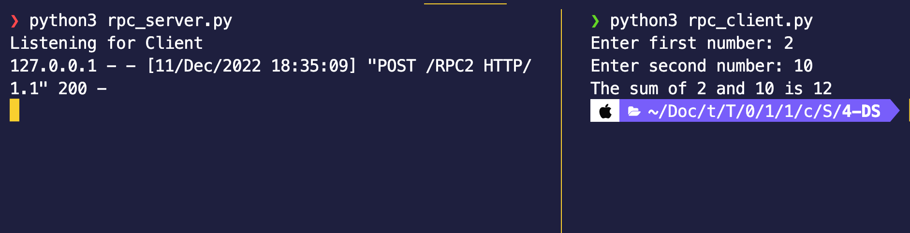

<!-- _class : lead -->

# RPC USING PYTHON

---

# xmlrpc

XML-RPC is a Remote Procedure Call method that uses XML passed via HTTP as a transport. With it, a client can call methods with parameters on a remote server (the server is named by a URI) and get back structured data.

---

<!-- _class : lead -->

# SERVER SIDE

---

## Imports

```python
from xmlrpc.server import SimpleXMLRPCServer
```

---

## Define remote function

```python
def sum_of_two(x,y):
    return x + y
```

---

## Initialize server @ ip:port

```python
# initialize the server at localhost and port 8888
server = SimpleXMLRPCServer(('localhost',8888))
```

---

## Register a function

```python
server.register_function(sum_of_two, "sum")
```

---

## Wait for calls

```python
server.serve_forever()
```

---

<!-- _class : lead -->

# CLIENT SIDE

---

## Imports

```python
from xmlrpc.client import ServerProxy
```

---

## Initialize server

```python
server = ServerProxy("http://127.0.0.1:8888")
```

---

## Call method from server

```python
server_output = server.sum(x,y)
```

---

## Use our results

```
print(f'The sum of {x} and {y} is {server_output}')
```

---

<!-- _class : lead -->

# DEMO

---

Output



---

Code for this presentation can be found at

https://github.com/ahmad1284/rpccodez


For more resources on xmlrpc

https://docs.python.org/3/library/xmlrpc.html
